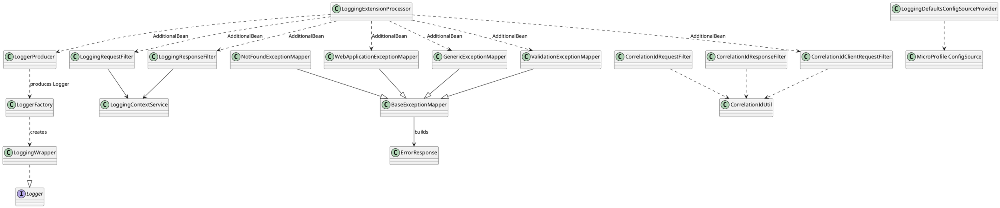

# Klassendiagramm (High-Level)

Das Diagramm zeigt die wichtigsten Typen und ihre Beziehungen zwischen Logger API, Filtern, CorrelationId-, Exception- und Deployment-Logik.

Hinweis: Es werden bewusst nur Kernbeziehungen gezeigt; Utility-/Security-Klassen sind ausgelassen.
