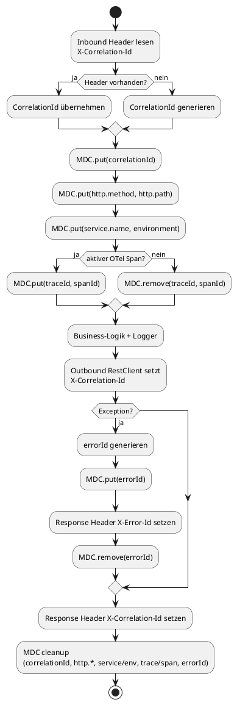

# MDC-Datenfluss

Dieses Diagramm fokussiert auf die gesetzten und gelöschten MDC-Keys sowie Header im Request/Response-Lebenszyklus.

Wichtige Header: `X-Correlation-Id`, `X-Error-Id`. Wichtige MDC-Keys: `correlationId`, `http.method`, `http.path`, `service.name`, `environment`, `traceId`, `spanId`, `errorId`.
