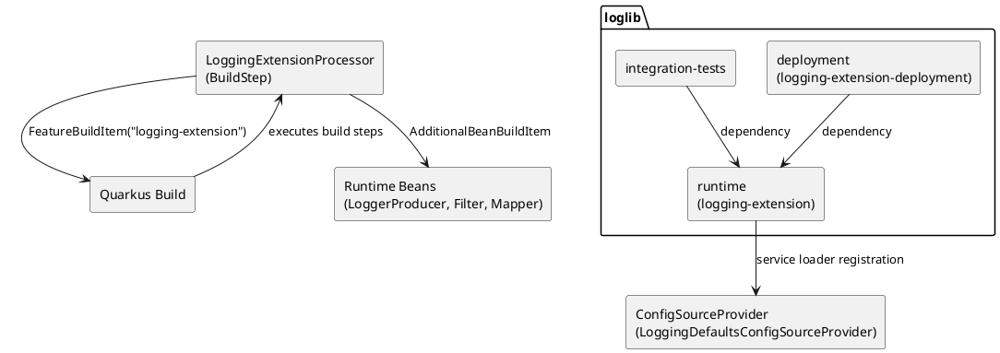

# Komponentendiagramm / Moduldiagramm

Dieses Diagramm zeigt die Maven-Module und wie die Quarkus-Extension-Mechanik Deployment- und Runtime-Anteile verbindet.

Hinweis: Die Defaults stammen aus einem `ConfigSourceProvider` im Runtime-Modul und können im Consumer über `application.properties` überschrieben werden.
