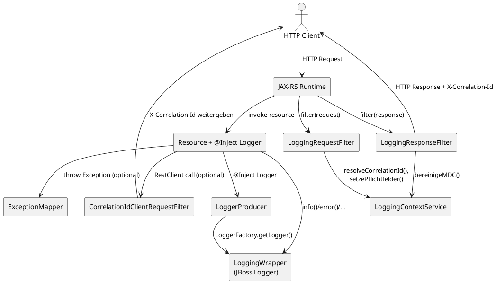

# Architektur-Überblick

Diese Seite fasst die zentralen Laufzeit-Flows der Extension zusammen: Logger-Injection, Inbound/Outbound-CorrelationId, MDC-Befüllung und Exception-Handling.

Legende: CorrelationId wird für Inbound/Outbound über `X-Correlation-Id` geführt, Fehler über `X-Error-Id`, und strukturierte Felder werden im MDC gehalten.
