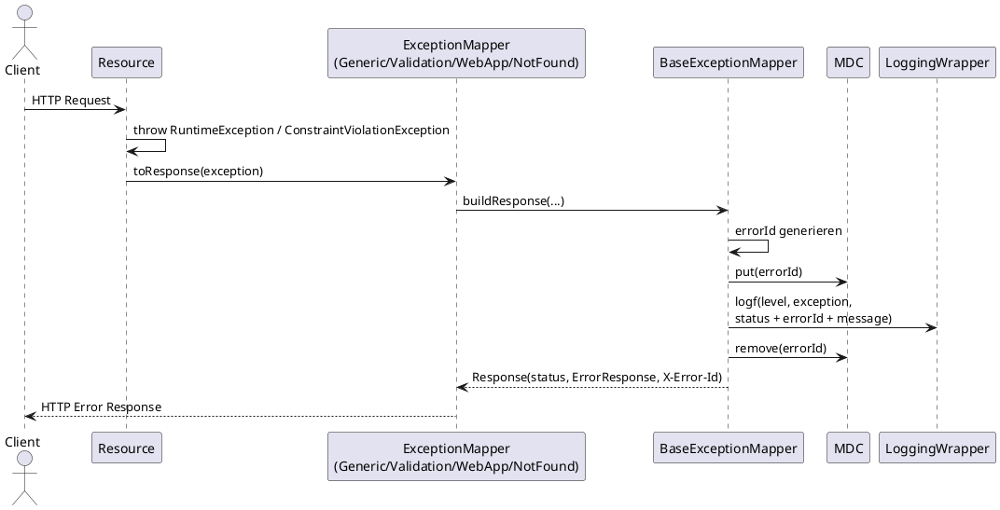

# Sequenzdiagramm: Exception Handling

Bei Fehlern erzeugen die ExceptionMapper ein einheitliches Fehlerformat und setzen den Header `X-Error-Id`.

`ErrorResponse` enthält `errorId`, `status` und `message`; dieselbe `errorId` wird zusätzlich als Header ausgeliefert.
