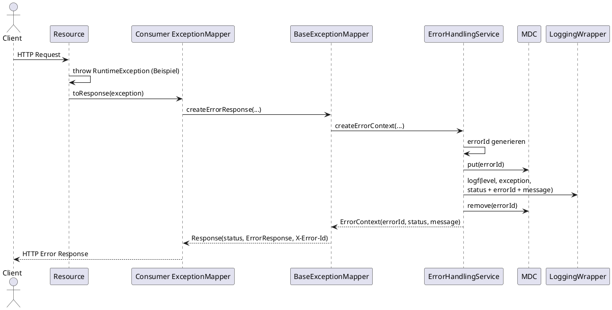

# Sequenzdiagramm: Exception Handling

Bei Fehlern kann der Consumer eigene ExceptionMapper bereitstellen, die auf `BaseExceptionMapper` aufbauen und ein einheitliches Fehlerformat inklusive `X-Error-Id` erzeugen.

`ErrorResponse` enthält `errorId`, `status` und `message`; dieselbe `errorId` wird zusätzlich als Header ausgeliefert. Ohne Consumer-Mapper greift keine globale Exception-Umwandlung durch die Extension.
