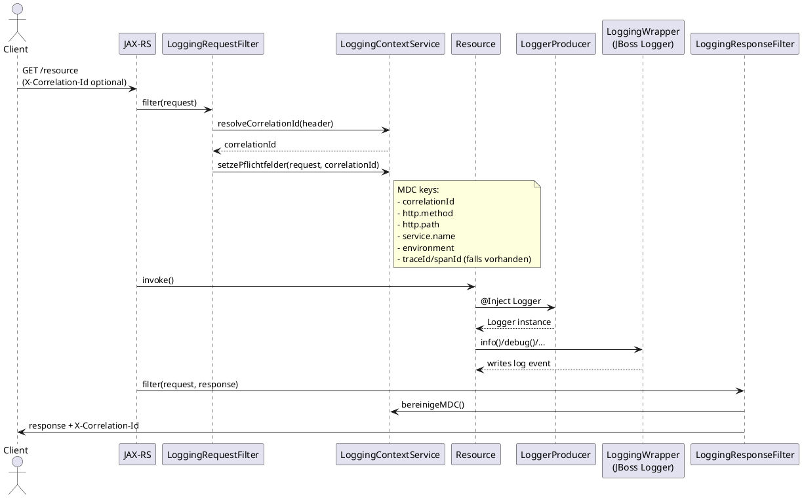

# Sequenzdiagramm: Happy Path Request

Happy Path für einen eingehenden HTTP-Request inklusive MDC-Befüllung, Logger-Nutzung und Cleanup im Response-Filter.

Ergebnis: Logs im Request enthalten konsistente MDC-Werte, nach dem Response werden die Felder aufgeräumt.
