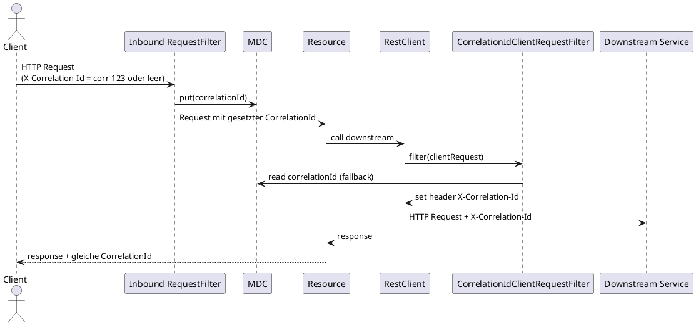

# Sequenzdiagramm: Outbound Propagation (Fanout/Call)

Das Diagramm zeigt, wie eine eingehende CorrelationId über den RestClient in Downstream-Calls propagiert wird.

Damit bleibt die gleiche CorrelationId über Inbound, interne Verarbeitung und Outbound-Aufrufe erhalten.
